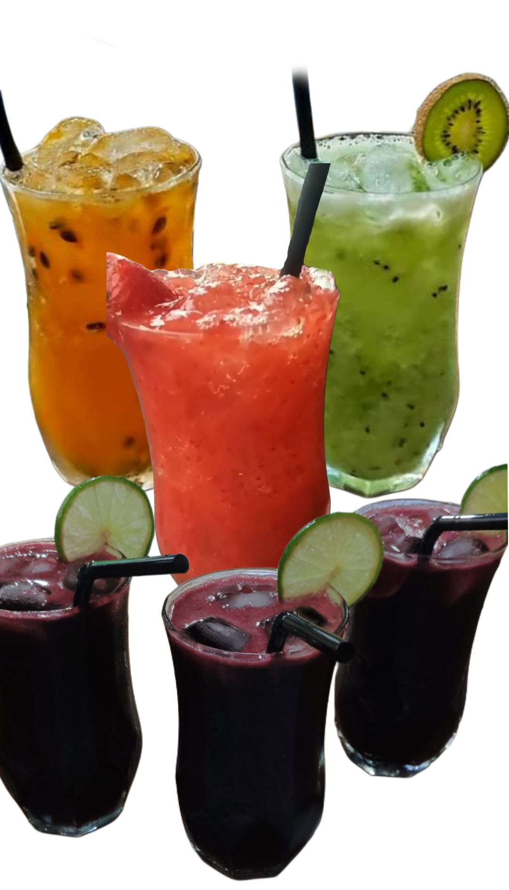
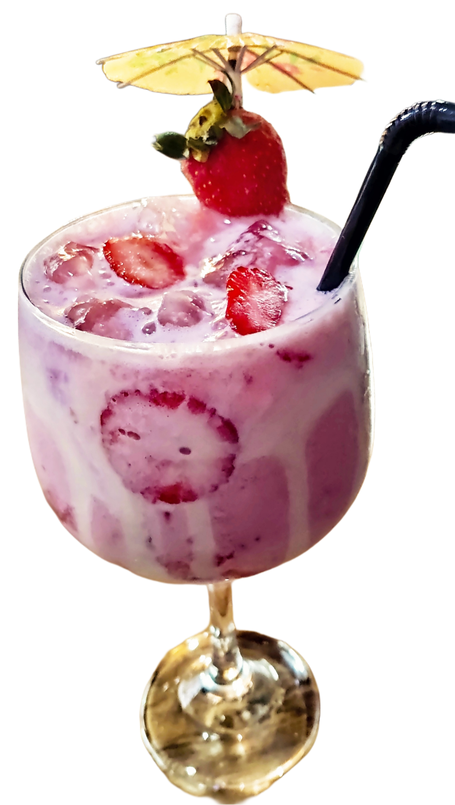
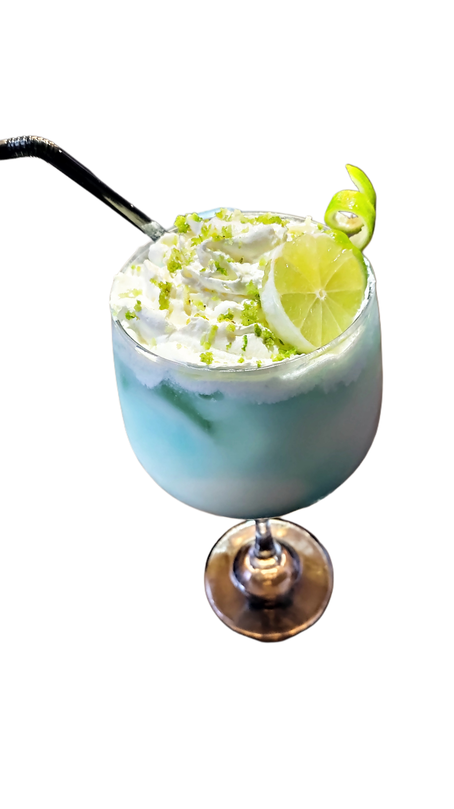
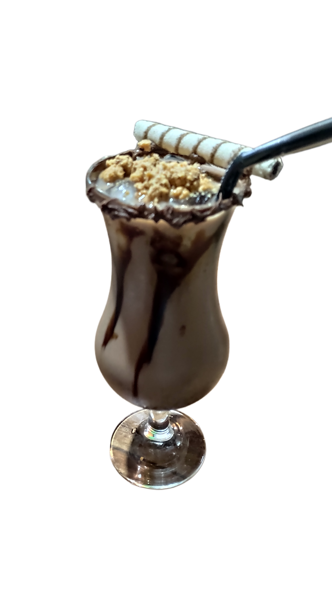
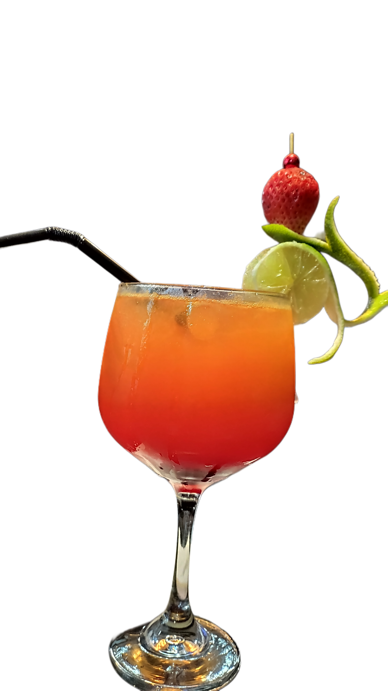
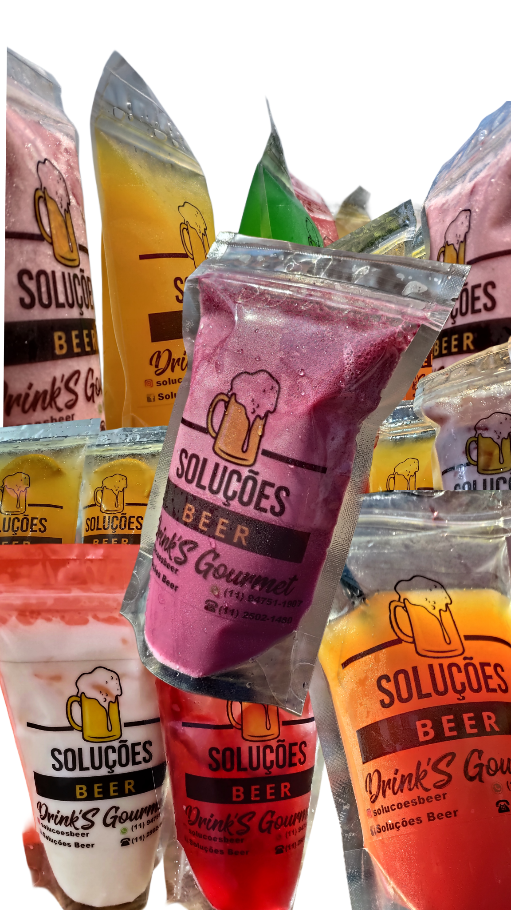
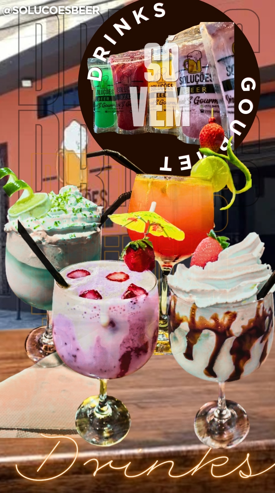
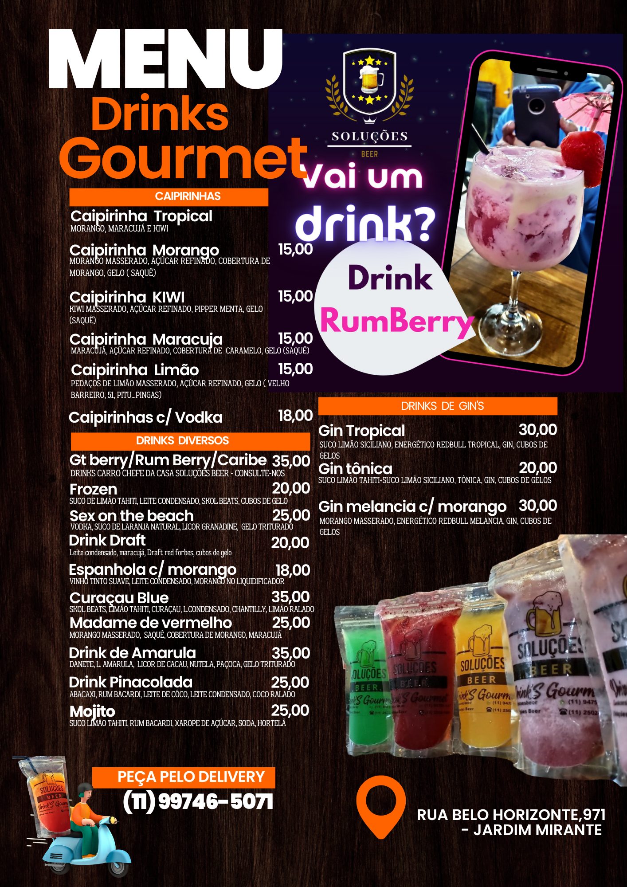
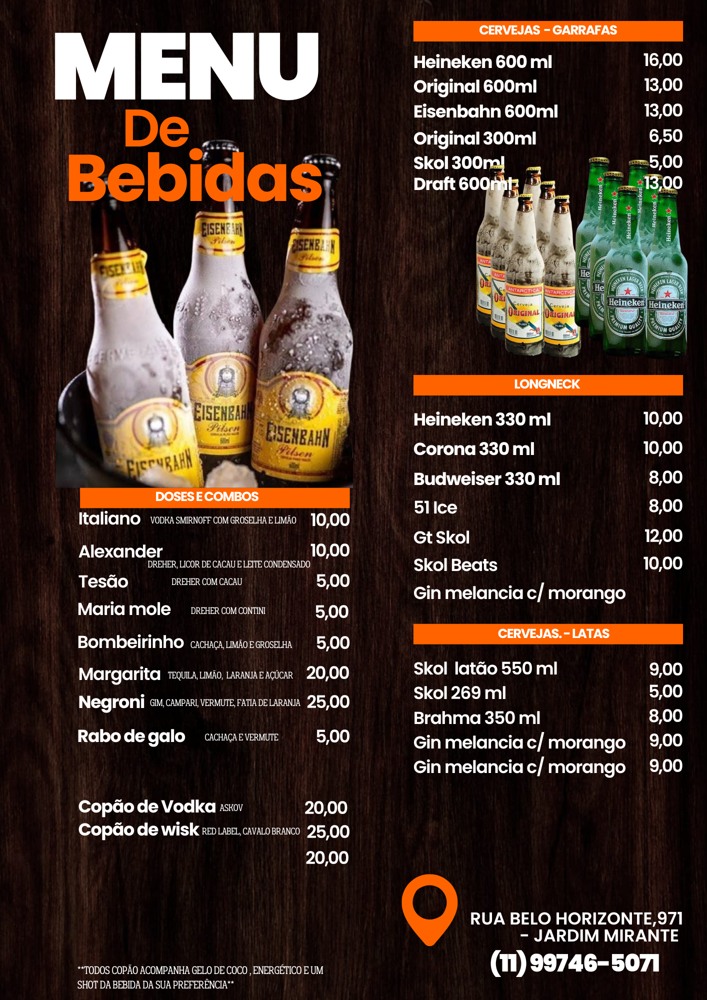
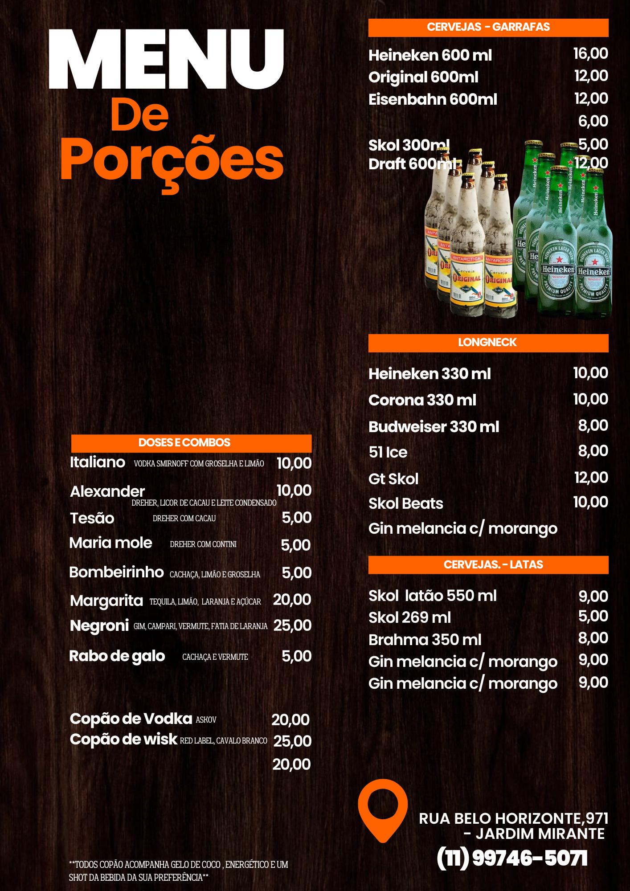

# Solucoes-Beer

<!DOCTYPE html>
<html lang="pt-br">
<head>
    <meta charset="UTF-8">
    <title>Soluções Beer</title>

    <link href="https://fonts.googleapis.com/css2?family=Lobster&family=Open+Sans&display=swap" rel="stylesheet">
    <meta name="viewport" content="width=device-width, initial-scale=1.0">

    
 
</head>

<body id="pagina">

    <h1>Bem-vindo ao Soluções Beer</h1>
    <h2>O melhor bar da cidade</h2>

    
Trabalhamos com os <strong>melhores drinks</strong>, cervejas <em>geladas</em> e porções de tira gosto.

    

        

            <h3>Nossos diferenciais:</h3>
            

                Ambiente moderno  
                Atendimento exclusivo  
                Drinks personalizados
            

            <h4>Visite-nos e viva a experiência!</h4>
            <h6>BEBA COM MODERAÇÃO</h6>

            <h3>Drinks Mais Pedidos:</h3>

            <ul>
                <li>
                    

                        <button id="btn-caipirinha">Caipirinhas</button>
                                                
                    

                </li>

                <li>
                    

                        <button id="btn-RunBerry">Drink Run Berry</button>
                        

                    

                </li>

                <li>
                    

                        <button id="btn-curacaublue">Drink Curaçau Blue</button>
                        

                    

                </li>

                <li>
                    

                        <button id="btn-Marula">Drink Marula</button>
                        
                    
                    

                </li>

                <li>
                    

                        <button id="btn-Sunset">Drink Sunset</button>
                        
                    
                    
                  
                </li>

                <li>
                    

                        <button id="btn-Saquinho">Drinks Gourmet-Delivery</button>
                        
                    
                    

                    
                </li>

                
            </ul>
        

        
    

    
        

            <!-- todo o conteúdo atual que você quer esconder -->
        

    

    

        <a href="#" class="cardapio" id="btn-cardapio">Nosso Cardápio</a>
    

     

        
        
      

      
      

        <button class="botao-carrossel" id="btn-anterior">Anterior</button>
        
        
        
        <button class="botao-carrossel" id="btn-proximo">Próximo</button>
    

      

      

    <form id="formulario" action="#" method="post" onsubmit="enviarWhatsApp(event)">
        <label>Nome:</label> 
        <input type="text" name="nome" id="nome" required>  
    
        <label>Telefone:</label> 
        <input type="tel" name="telefone" id="telefone" required>  
    
        <label>Mensagem:</label> 
        <textarea name="mensagem" id="mensagem"></textarea>  
    
        <button type="submit" id="btnEnviar">Enviar</button>
    </form>

     

    <a id="instagramBtn" href="https://instagram.com" target="_blank">Nosso Instagram</a>
    

    <!-- JavaScript para mostrar/ocultar a imagem da caipirinha -->
    

    

</body>
</html>
